# Task Manager App (Flutter + GetX + REST API + SharedPreferences)

A complete Task Manager mobile application built with Flutter using GetX state management, REST API integration, and SharedPreferences for local storage.

This project demonstrates clean architecture, API handling, authentication, and GetX state management.

---

## Features

- User Login / Signup
- Email Verification
- Token Save using SharedPreferences
- Forgot Password handling
- Auto Login using Saved Token
- Add Task
- Delete Task
- Change Task Status
- Show Task Count by Status
- Show Task List by Status
- GetX State Management
- GetX Navigation
- REST API Integration
- Loader & Error Handling
- Clean Architecture

---

## Technologies Used

- Flutter
- Dart
- GetX
- REST API
- HTTP Package
- SharedPreferences
- MVC Pattern
- JSON Parsing

---

## GetX Used For

- State Management
- Navigation
- Dependency Injection

---

## SharedPreferences Used For

- Save Login Token
- Save User Info
- Auto Login
- Logout

---

## API Used

Task Manager API used for:

- Login
- Registration
- Profile Update
- Create Task
- Update Task Status
- Delete Task
- Get Task Count by Status
- Get Task List by Status
- Forgot Password
    - Verify Email
    - Verify PIN
    - Reset Password

---

## App Screenshots

| Splash Screen | Sign In | Sign Up |
|-------------|---------|---------|
| 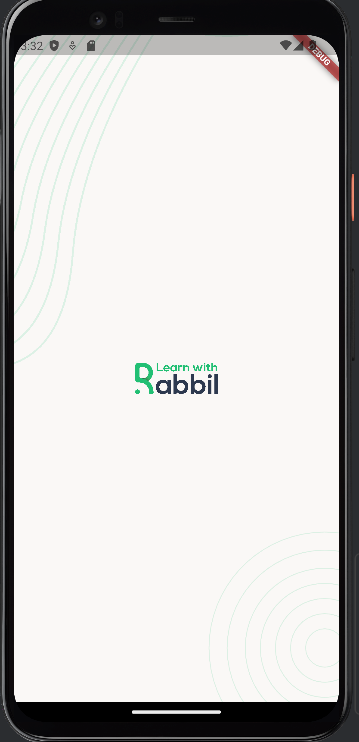 | 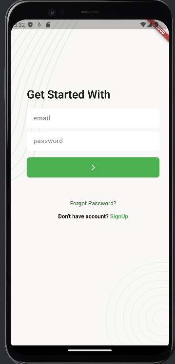 | 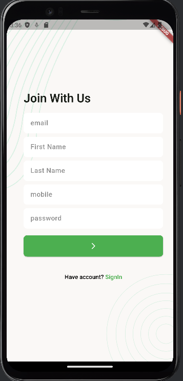 |

| New Task Dashboard | Completed Task Dashboard | Canceled Task Dashboard |
|--------------------|--------------------------|--------------------------|
| 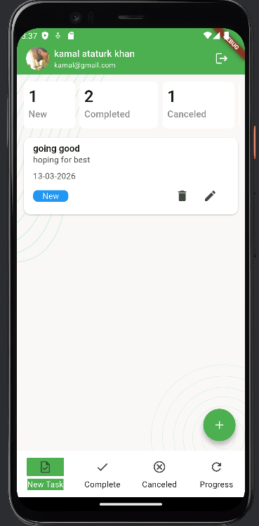 | 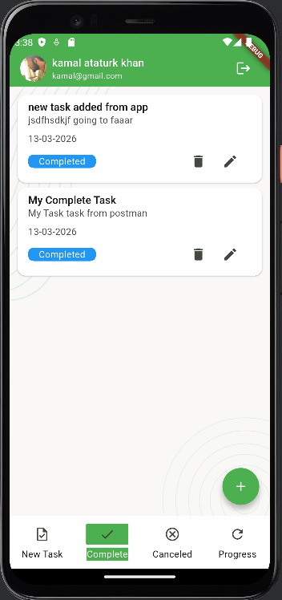 | 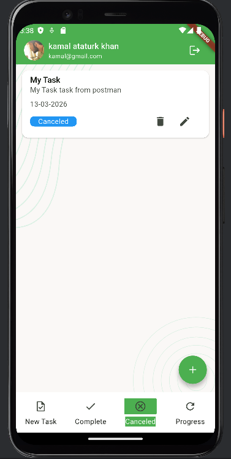 |

| Progress Task Dashboard | Add Task | Update Profile |
|--------------------------|----------|----------------|
| 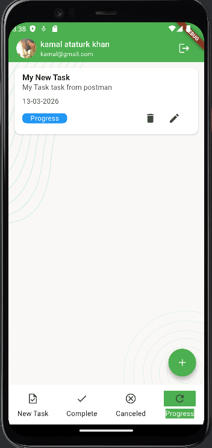 | 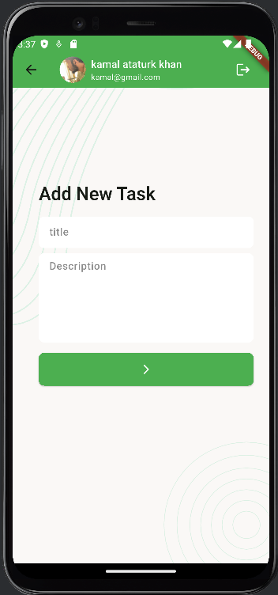 | 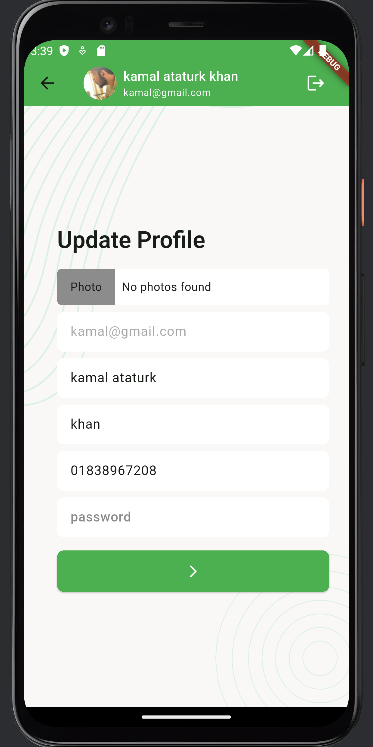 |

| Forgot Password | PIN Verification | Reset Password |
|-----------------|-----------------|---------------|
| 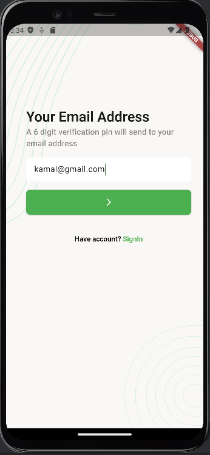 | 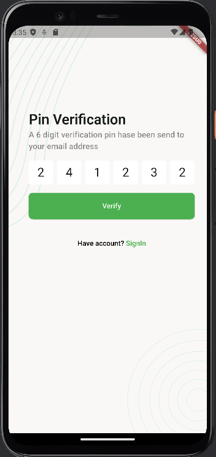 | 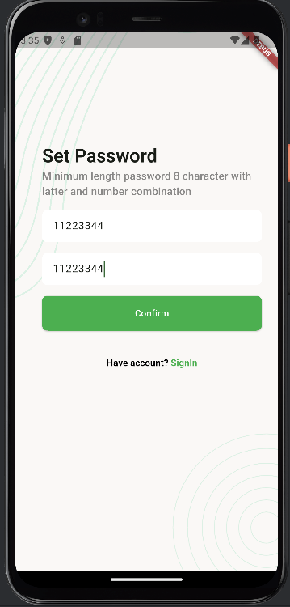 |

| Update Status | Delete Task |
|--------------|-------------|
| 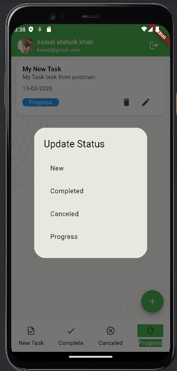 |  |

---

## Developer

Abdul Aziz Patwary  
Flutter Developer  
Bangladesh

GitHub: https://github.com/abdulazizpatwary

---

## Future Update

- Firebase Notification
- Dark Mode
- Offline Mode
- Animation
- Local Database